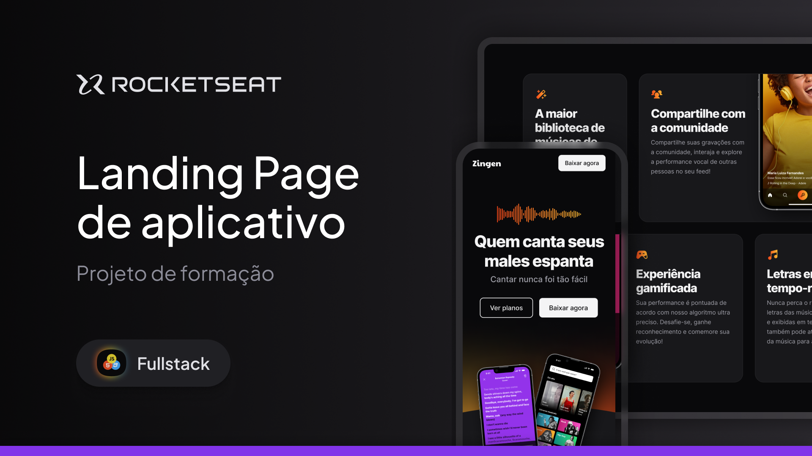

<h1 align="center"> Portfólio Dev - Desafio Prático</h1>

A Landing Page de marketing completa e responsiva de um aplicativo de Karaokê chamado Zingen.
 
Esse é um dos projetos desenvolvidos em aula na formação Full-stack, um dos conteúdos de especialização da Rocketseat. 

  <a href="#-tecnologias">Tecnologias</a>&nbsp;&nbsp;&nbsp;|&nbsp;&nbsp;&nbsp;
  <a href="#-projeto">Projeto</a>&nbsp;&nbsp;&nbsp;|&nbsp;&nbsp;&nbsp;
  <a href="#-layout">Layout</a>&nbsp;&nbsp;&nbsp;|&nbsp;&nbsp;&nbsp;
  <a href="#memo-licença">Licença</a>

  

 

  

## 🚀 Tecnologias

Esse projeto foi desenvolvido com as seguintes tecnologias:

- HTML e CSS
- Git e Github
- Figma

## 💻 Projeto

A Landing Page de marketing completa e responsiva de um aplicativo de Karaokê chamado Zingen. Este foi o primeiro projeto em que apliquei o conhecimento adquirido sobre media queries e derivados, logo, este é um site 100% responsivo. Neste módulo de estudo sobre responsividade, percebi o quanto o conhecimento sobre este assunto é valioso e importante no mundo do desenvolvimento, pois antes, os meus projetos não eram responsivos, e de agora pra frente, todos serão! Estou ansioso para os próximos desafios!

## 🔖 Layout

Você pode visualizar o layout do projeto através [DESSE LINK](https://www.figma.com/design/t6khgihyX204BoAyoHRc3U/LP-de-produto--Community-?m=auto&t=M6ij9lQnIsoNqY21-6). É necessário ter conta no [Figma](https://figma.com) para acessá-lo.

## :memo: Licença

Esse projeto está sob a licença MIT.

---

Feito com ♥ by Arthur Costa :wave: